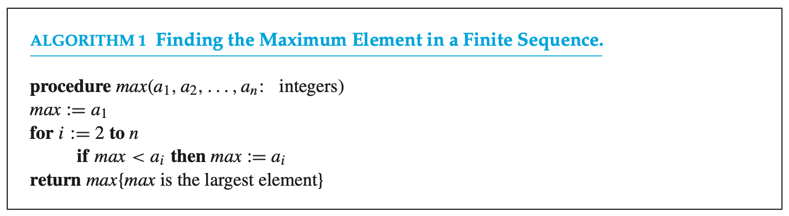
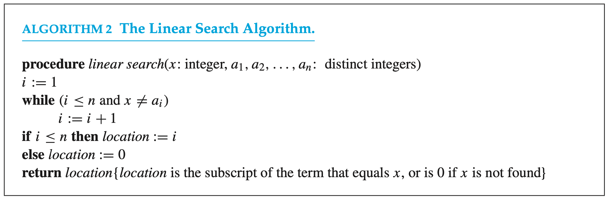

# COMP2711 Discrete Math for CS

## [Algorithm] Review Notes

### 1. The growth of functions

- Big-$O$ Notation

  - **Def:** $f(x)$ is $O(g(x))$ if there are constants $C$ and $k$ such that:

    $|f(x)|\le C|g(x)|$, whenever $x>k$

  - It means $f(x)$ grows slower that some fixed multiple of $g(x)$ as $x$ grows without bound.

  - $C$ and $k$ are called **witnesses**. We need **only one pair** of witnesses to establish this relationship.

  - Example: Show that $f(x)=x^2+2x+1$ is $O(x^2)$.

    [Ans]$0\le x^2+2x+1\le x^2+2x^2+x^2=4x^2$ whenever $x>1$.

    [**Remark**] 

    - It's also **true** that $f(x)$ is $O(x^3)$, $f(x)$ is $O(x^2+2x+1)$, ( $ x^2<x^2+2x+1$whenever $x>1$)
    - If $f(x)$ is $O(g(x))$ and $g(x)$ is $O(f(x))$, we say they are of the **same order**.

  - $f(x)$ is $O(g(x))$ is sometimes written $f(x)=O(g(x))$, however, more accurate way is $f(x)\in O(g(x))$.

  - Example : Show that $n^2$ is not $O(n)$

    [Ans] Use prove by contradiction. There's no pair of witnesses such that $n\le C$.

  - **Theorem1:** Let $f(x)=a_nx^{n}+a_{n-1}x^{n-1}+\cdots +a_1x+a_0$. then $f(x)$ is $O(x^n)$

    [Proof] Using triangle inequality, if $x>1$, then

    $|f(x)|\le |a_n|x^n+|a_{n-1}|x^{n-1}+\cdots +|a_1|x+|a_0|$

    $=x^n(|a_n|+|a_{n-1}|/x+\cdots +|a_1|/x^{n-1}+|a_0|/x^n)$

    $\le x^n (|a_n|+|a_{n-1}|+\cdots +|a_1|+|a_0|)$

  - Examples:
    - $1+2+\cdots+n\le n+n+\cdots +n=n^2$
    - $n!\le n\cdot n\cdot \cdots\cdot n=n^n$, then $\log n!\le n\log n$

  - **Theorem2:** Suppose that $f_1(x)$ is $O(g_1(x))$ and $f_2(x)$ is $O(g_2(x))$, then

    $(f_1+f_2)(x)$ is $O(\max (|g_1(x)|, |g_2(x)|))$

  - **Corollary:** Suppose that $f_1(x), f_2(x)$ are both $O(g(x))$, then $(f_1+f_2)(x)$ is $O(g(x))$

  - **Theorem3: **Suppose that $f_1(x)$ is $O(g_1(x))$ and $f_2(x)$ is $O(g_2(x))$, then

    $(f_1f_2)(x)$ is $O(g_1(x)g_2(x))$

  - Example: Give a big-$O$ estimate for $f(n)=3n\log(n!)+(n^2+3)\log n$.

    [Ans] $\log(n!)$ is $O(n\log n)$, thus $f(n)$ is $n^2\log n$.

  - Example: Give a big-$O$ estimate for $f(n)=(x+1)\log(x^2+1)+3x^2$.

    [Ans] $\log(x^2+1)\le \log (2x^2)=\log 2+2\log x\le 3\log x$.

    Thus $f(n)=O(\max(x\log x, x^2))=O(x^2)$.

- Big-Omega Notation

  - **Def:** $f(x)$ is $\Omega(g(x))$ if there are constants $C$ and $k$ such that:

    $|f(x)|\ge C|g(x)|$, whenever $x>k$

  - $f(x)$ is $\Omega(g(x))$ **if and only if ** $g(x)$ is $O(f(x))$.

- Big-Theta Notation

  - **Def:** $f(x)$ is $\Theta(g(x))$ if $f(x)$ is $O(g(x))$ and $f(x)$ is $\Omega(g(x))$, we say $f(x)$ and $g(x)$ are of the **same order**.

  - Example: Show that $f(n)=1+2+\cdots +n$ is $\Theta(n^2)$.

    [Ans] We've already showed that $f(n)$ is $O(n^2)$ previously.

    Omit the first $\lfloor n/2 \rfloor$ items, then $f(n)\le \frac{n}{2}+\frac{n}{2}+\cdots +\frac{n}{2}$, where there're $\frac{n}{2}$ items of $\frac{n}{2}$.

    Thus $f(n)\le \frac{n^2}{4}$

  - **Theorem4:** Let $f(x)=a_nx^{n}+a_{n-1}x^{n-1}+\cdots +a_1x+a_0$. then $f(x)$ is $\Theta(x^n)$

### 2. Algorithms and Complexity

- Algorithms
  - A **finite** sequence of **precise** instructions for performing a computation or for solving a problem.
  - Properties: Input, Ouput, Definiteness, Correctness, Finitenexx, Effectiveness, Generality.

- Find the max element

  

  

- 

  

