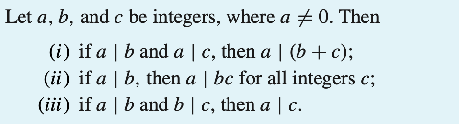
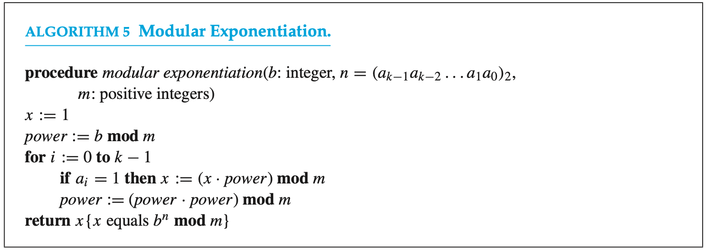
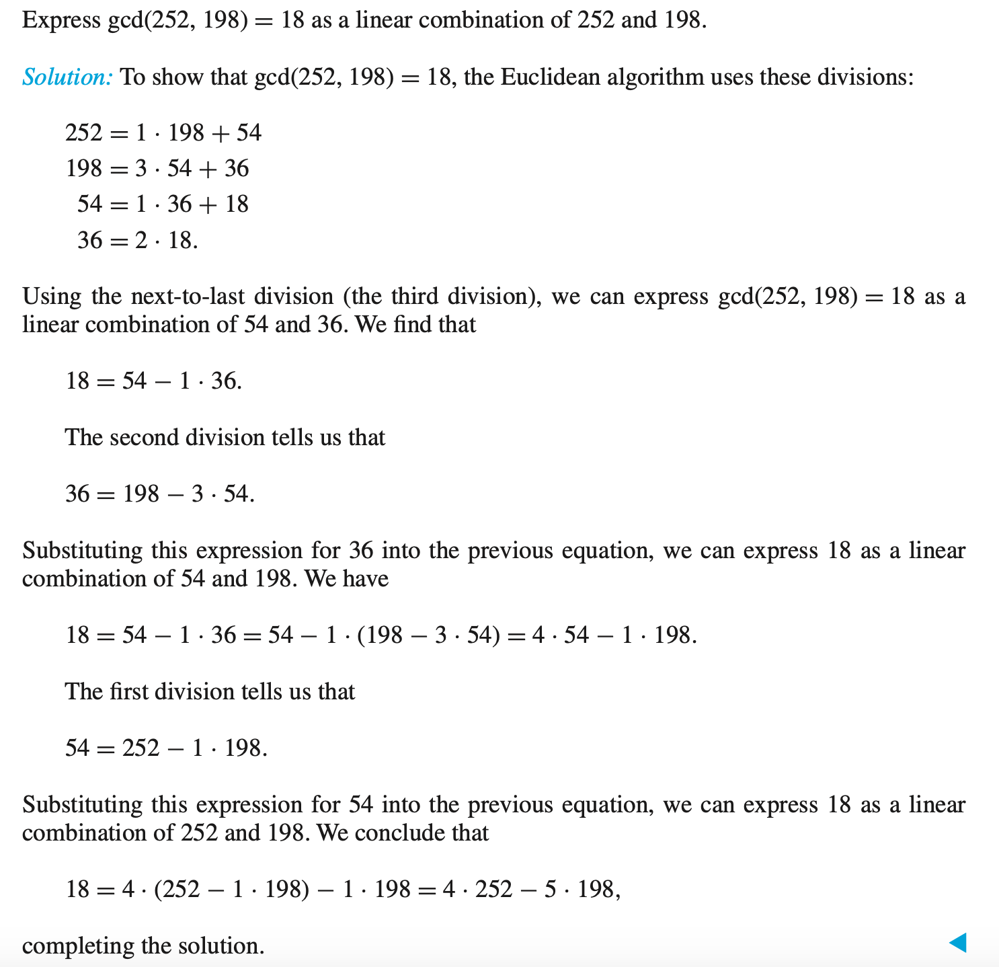
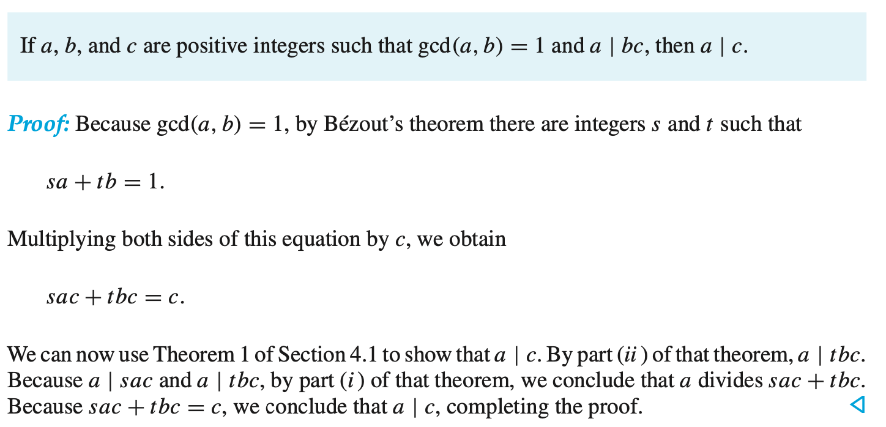
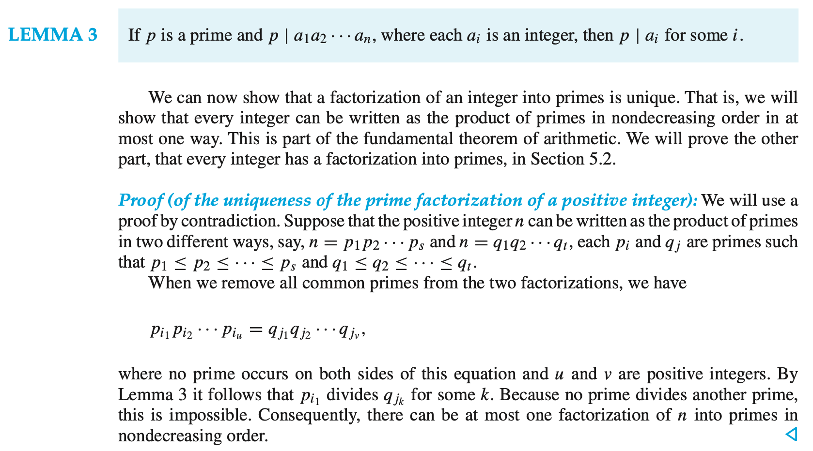
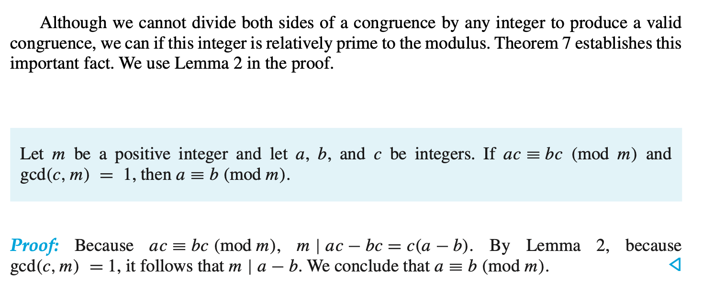
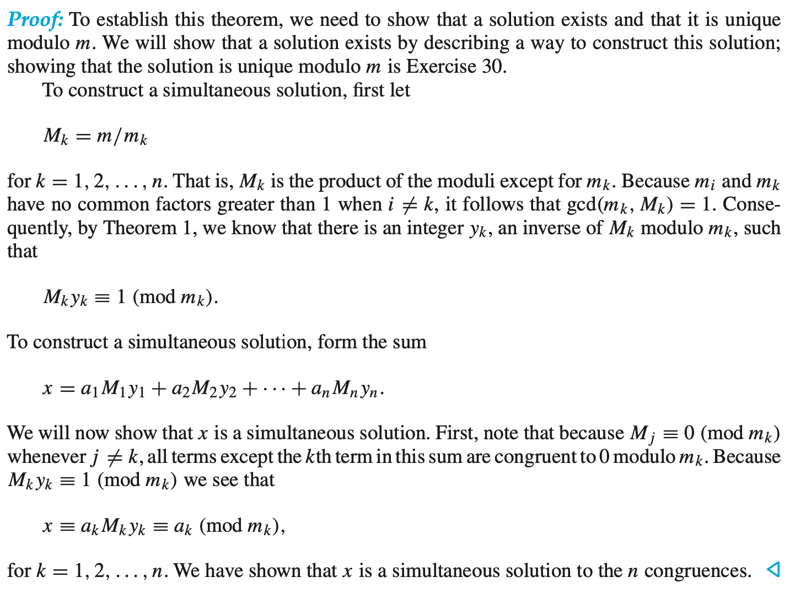

# COMP2711 Discrete Math for CS

## [Number Theory] Review Notes

### 1. Divisibility and Modular Arithmetic

- **divisibility:** if $b=ac$, then $a\mid b$; otherwise, $a\nmid b$

- Properties:

  

- **The Division Algorithm : ** Let $a$ be an int and $d$ a +ve int. Then there're **unique** int $q$ and $r$, with $0\le r<d$, such that $a=dq+r$.

- **Congruence**

  - $a\equiv b \pmod m$ :  $a$ is congruent to $b$ modulo $m$.
  - $a\equiv b\pmod m \Leftrightarrow \exist k, a=b+km$. (**often used in proof.**)
  - If $a\equiv b \pmod m$ and $c\equiv d\pmod m$, then $a+c\equiv b+d\pmod m$, and $ac\equiv bd \pmod m$.

- Arithmetic Modulo $m$.

  - $a+_mb=(a+b)\pmod m$.
  - $a\cdot_mb=(a\cdot b)\pmod m$.

- **Modular Exponentiation**

  - Find $b^n\pmod m$ efficiently.

    - $n=(a_{k-1}\cdots a_1a_0)_2$.
    - $b^n=b^{a_{k-1}\cdot 2^{k-1}+\cdots+a_1\cdot 2+a_0}=b^{a_{k-1}\cdot 2^{k-1}}\cdots b^{a_1\cdot 2}\cdot b^{a_0}$
    - Thus, only need to find $b, b^2, b^4, \cdots b^{2^{k-1}}\mod m$

    

###  2. Primes and GCD

- **Prime**

  - **The fundamental theorem of arithmetic**:

    Every integer greater than 1 can be written **uniquely** as a prime or as the product of two or more primes where the prime factors are written in order of nondecreasing size.

  - If $n$ is a composite integer, it has a prime divisor $\le \sqrt{n}$.

  - **Theorem : **There are infinitely many primes.

    [Proof] Use proof by contradiction. Assume there're finitely many primes, $p_1, \cdots, p_n$.

    Let $Q=p_1p_2\cdots p_n+1$.

    By *the fundamental theorem of arithmetic*, $Q$ is prime or else it can be written as the product of two or more primes. However, none of the primes $p_j$ divides $Q$, for if $p_j \mid Q$, then $p_j\mid Q-\Pi p_i=1$.

    Hence, there's a prime not in the list $p_1, p_2, \cdots p_n$. Contradiction found!

    **Note that $Q$ is not necessary a prime. The prime not in the list is either $Q$, if it is prime, or a prime factor of $Q$**.

- **Greatest Common Divisors**

  - $\gcd (a,b)$ is the largest $d$ such that $d\mid a$ and $d\mid b$.

  - if $\gcd(a,b)=1$, they are **relatively prime**.

  - if $\gcd(a_i, a_j)=1$ whenever $1\le i<j\le n$, then $a_1, \cdots a_n$ are **pairwise relatively prime**.

  - if $a=p_1^{a_1}p_2^{a_2}\cdots p_n^{a_n}$, $a=p_1^{b_1}p_2^{b_2}\cdots p_n^{b_n}$, then $\gcd(a,b)=p_1^{\min(a_1, b_1)}\cdots p_n^{\min (a,b)} $,

    ${\rm lcm}(a,b)=p_1^{\max(a_1, b_1)}\cdots p_n^{\max (a,b)} $

  - thus, ${\rm lcm}(a,b)\cdot \gcd(a,b)=a\cdot b$

- **The Euclidean Algorithm**

  - Let $a=bq+r$, then $\gcd(a,b)=\gcd(b,r)$.

    [Proof] Suppose $d$ divides both $a$ and $b$, then $d$ must also divides $a-bq=r$ .

    Hence, any common divisor of $a$ and $b$ is also a common divisor of $b$ and $r$.

    Conversely, suppose $d$ divides both $b$ and $r$, then $d$ must also divides $bq+r=a$ .

    Hence, any common divisor of $b$ and $r$ is also a common divisor of $a$ and $b$.

  - The GCD is the last **nonzero remainder** in the sequence of divisions.

- **Bezout's Theorem**

  - If $a,b$ are positive integers, then there exist integers $s,t$ such that $sa+tb=\gcd(a,b)$

  - $s,t$ are called **Bezout coefficients **of $a, b$.

  - Use **extended Euclidean algorithm** to find Bezour coefficient

    

- Useful **lemmas**.

  

  

  

### 3. Solving Congruences

- **Multiple inverse**

  - If $a$ and $m>1$ are relatively prime, then an inverse of $a$ **modulo** $m$ exists, such that $a\cdot \bar{a}\equiv 1\pmod m$.

    - Proof of existance: use bezout identity
    - Proof of uniqueness: omit here. (*to be completed.*)

  - Example: Find an inverse of 101 modulo 4620.

    [Ans] By extended Euclidean algorithm, $1=-35\cdot 4620+1601\cdot 101$.

    So that $1601\cdot 101\equiv 1\pmod {4620}$, thus $1601$ is an inverse of $101$ modulo $4620$.

- Solve **linear** congruence
  - Multiply both sides by inverse 
  - $3x\equiv 4\pmod 7 \Leftrightarrow -2\cdot 3x\equiv -2\cdot 4\pmod 7\Leftrightarrow x\equiv -8 \equiv 6\pmod 7$.

- Solve **system** of linear congruence

  - **The Chinese Remainder Theorem**:

    Let $m_1,m_2,\cdots m_n$ be **pairwise relatively prime positive integers**, and $a_1,a_2,\cdots,a_n$ arbitrary.

    Then the system

    $$\left\{ \begin{array}{c}x\equiv a_1\pmod {m_1}\\x\equiv a_2\pmod {m_2}\\\cdots\\x\equiv a_n\pmod {m_n}\end{array} \right.$$

    has a **unique** solution modulo $m=m_1m_2\cdots m_n$.

  - **Proof** of  CRT:

    

- **Fermat's Little Theorem**

  - If $p$ is prime and $a$ is **not divisible** by $p$, then $a^{p-1}\equiv 1\pmod p$.

  - $a^p\equiv a\pmod p$ for **any** $a$.

  - Example: Find $7^{222}\pmod {11}$.

    [Ans] $7^{222}=7^{22\cdot 10+2}=(7^{10})^{22}\cdot 7^2\equiv 1^{22}\cdot 49\equiv 49\pmod {11}$.

### 4. Applications of Congruences

- Hashing functions
- Pseudorandom Numbers
- Check digits

### 5. Cryptography

- Shift cipher
  - $A\sim Z$ replaced by $0\sim 25$
  - $f(p)=(p+k)\pmod {26}$
  - $f^{-1}(p)=(p-k)\pmod{26}$
- Affine cipher
  - $f(p)=(ap+b)\pmod {26}$
  - Need to guarantee that $f$ is a bijection, that is, **if and only if** $gcd(a,26)=1$.
  - decrypt:
    - Suppose $c=(ap+b)\pmod{26}$
    - solve congruence: $c-b\equiv ap \pmod{26}$
    - $p\equiv a^{-1}(c-b)\pmod {26}$

- Block cipher : transposition cipher
  - Use a permutation $\sigma$ of set $\{1,2,\cdots, m\}$ to itself.
  - If $\sigma(1)=3$, it means that the first letter in plaintext will be transported to the third position.

- RSA

  - each individual has an encryption key $(n,e)$, where modulus $n=pq$，exponent $e$ is relatively prime to $(p-1)(q-1)$.

  - The product of large primes, with approx 400 digits, **cannot be factored** in a reasonable length of time.

  - **Encryption**:

    - Translate each letter into a two-digit number
    - divide string into blocks of $2N$ digits, which is the **largest even** number that $2525\cdots 25$ with $2N$ digits does not exceed $n.$ (When necessary, add dummy nums)

    - ciphertext block $C=M^e \pmod n$. 
    - calculate using **fast modular exponentiation**.

  - Example: Encrypt `STOP` using key $(2537, 13)$.

    [Ans] Since $2525<2537<252525$, we group numbers into blocks of 4.

    $1819 \ \ \ 1415$

    Then encrype, $1819^{13}\pmod {2537}=2081, 1415^{13}\pmod {2537} = 2182$

    Encrypted message is $2081\ \ \ 2182$.

  - **Decryption:**
    - decryption key $d=e^{-1} \pmod{(p-1)(q-1)}$.
    - $C^d=(M^e)^d=M^{de}=M^{1+k(p-1)(q-1)}\pmod n$.
    - By **Fermat's little theorem**, $M^{p-1}\equiv 1\pmod p, M^{q-1}\equiv 1\pmod q$
    - Thus $C^d\equiv M\cdot (M^{p-1})^{k(q-1)}\equiv M\pmod p\equiv M\pmod q$.
    - Since $gcd(p,q)=1$, by **Chinese remainder theorem**, $C^d\equiv M\pmod {pq}$.

- Cryptographic protocols

  - Two parties exchange a secret key over an insecure communications channel without having shared any infos before.
  - **Diffie-Hellman key agreement protocol (DH)**:
    - Computations done in $\mathbb{Z}_p$
    - First choose prime $p$, a primitive root $a$ of $p$.
      - Alice chooses $k_1$, sends $a^{k_1}\pmod p$ to Bob.
      - Bob chooses $k_2$, sends $a^{k_2} \pmod p$ to Alice.
      - Shared key is $a^{k_1k_2}\pmod p$.
    -  **Viewable to public : **$p,\ a,\ a^{k_1}\% p,\ a^{k_2}\%p$
    - Even with these four numbers, one cannot calculate $a^{k_1k_2}\mod p$.

- Digital Signatures
  - Alice use **private** key to **encrypt** message. (which was used to decrypt in RSA)
  - Receivers use Alice's **public** key to decrypt message.
  - So that receivers know it's Alice who sent the message.

